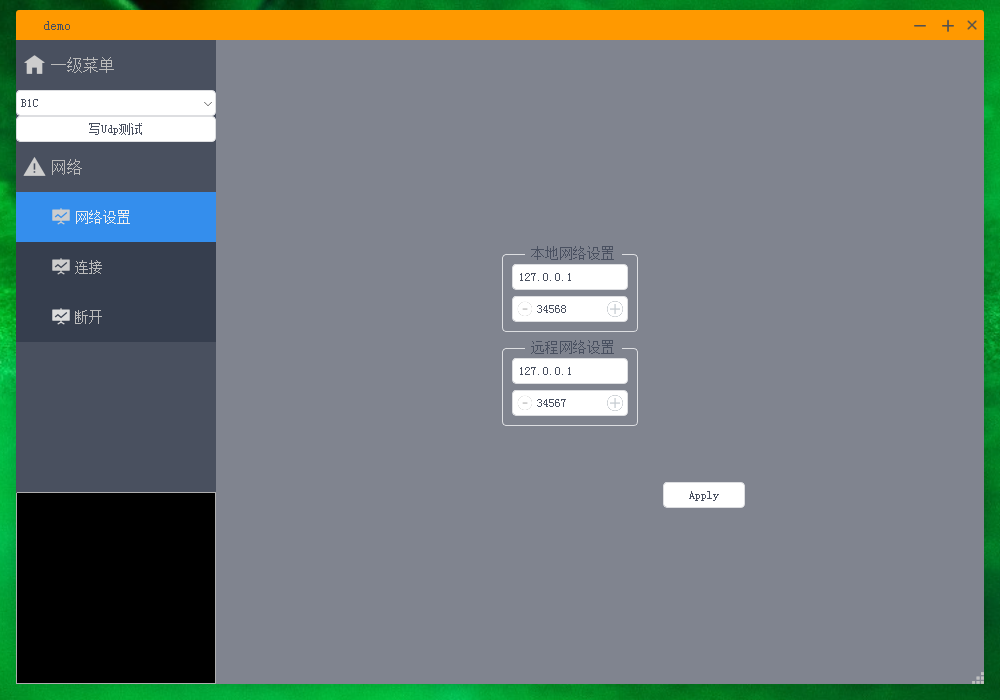

## ThreadSerial

多线程 异步 UDP 读写Qt5

附上部分前辈们链接：

狗哥 https://qtdebug.com/

https://github.com/xtuer/app-template

使用的3方库
- app-template
- AnimationButton
- barruler
- cpumemorylabel
- CTabWidget
- qdeviceWatcher
- QSimpleUpdater
- qtsingleapplication
- qxtglobalshortcut
- savewidgetdata
